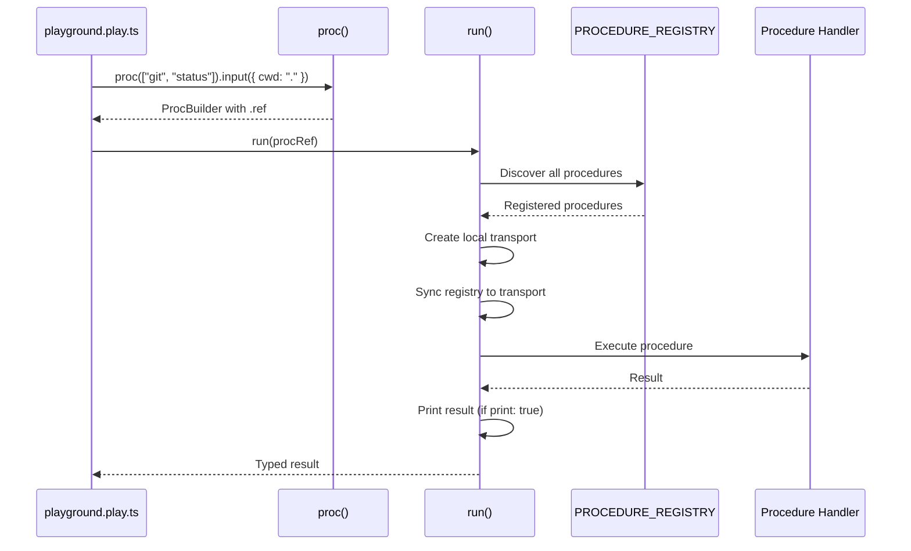

# @mark1russell7/client-playground

[](https://opensource.org/licenses/MIT)
[](https://nodejs.org)

> Type-safe aggregation building for procedure compositions

## Overview

`client-playground` provides a fluent TypeScript API for composing procedure references with full type safety and autocomplete. Write aggregations as executable TypeScript files (`.play.ts`) that can be run directly with `tsx` or `ts-node`. Perfect for testing procedure compositions, building complex workflows, and exploring procedure APIs interactively.

### Key Features

- **Type-Safe Builder API**: Fluent interface with full TypeScript autocomplete
- **Executable Scripts**: Write `.play.ts` files that run directly
- **Output References**: Reference previous stage outputs with `$ref` syntax
- **Named Stages**: Name stages for later reference in the execution DAG
- **Execution Control**: Control when procedures execute (`$immediate`, `$never`, `$parent`)
- **Local Transport**: Uses in-process transport for fast execution
- **Zero Configuration**: Auto-discovers registered procedures

## Architecture

```mermaid
graph TB
    subgraph "Playground File (.play.ts)"
        BUILDER[ProcBuilder API]
        REF[Output References]
        RUN[run() Executor]
    end

    subgraph "Runtime"
        LOCAL[Local Transport]
        REGISTRY[Procedure Registry]
        EXEC[Execution Engine]
    end

    subgraph "Procedures"
        PROC1[git.status]
        PROC2[git.add]
        PROC3[pnpm.install]
    end

    BUILDER --> REF
    REF --> RUN
    RUN --> LOCAL
    LOCAL --> REGISTRY
    REGISTRY --> EXEC
    EXEC --> PROC1
    EXEC --> PROC2
    EXEC --> PROC3

    style BUILDER fill:#7ed321
    style RUN fill:#f5a623
    style LOCAL fill:#50e3c2
```

### Execution Flow



## Installation

```bash
npm install @mark1russell7/client-playground
```

Or with pnpm:

```bash
pnpm add @mark1russell7/client-playground
```

### Dependencies

This package depends on:
- `@mark1russell7/client` - Core client/procedure system (dynamically imported)

### Runtime Requirements

- `tsx` or `ts-node` - For executing `.play.ts` files
- Node.js >=25.0.0

## Usage

### Quick Start

Create a playground file:

```typescript
// my-workflow.play.ts
import { proc, ref, run } from "@mark1russell7/client-playground";

// Execute a simple procedure
run(
  proc(["git", "status"]).input({ cwd: "." }).ref
);
```

Run it:

```bash
npx tsx my-workflow.play.ts
```

Output:

```json
{
  "branch": "main",
  "ahead": 0,
  "behind": 0,
  "files": [],
  "clean": true
}
```

### Builder API

The `proc()` builder provides a fluent interface:

```typescript
import { proc } from "@mark1russell7/client-playground";

// Simple procedure reference
const gitStatus = proc(["git", "status"])
  .input({ cwd: "/path/to/repo" })
  .ref;

// Named stage for reference
const hasChanges = proc(["git", "hasChanges"])
  .input({ cwd: "." })
  .name("changes")  // Can be referenced as $ref: "changes"
  .ref;

// With execution control
const conditionalAdd = proc(["git", "add"])
  .input({ all: true })
  .when("$parent")  // Execute in parent context
  .ref;
```

### Output References

Reference outputs from named stages:

```typescript
import { proc, ref, run } from "@mark1russell7/client-playground";

run(
  proc(["dag", "traverse"]).input({
    visit: [
      // Stage 1: Check for changes
      proc(["git", "hasChanges"])
        .name("changes")
        .ref,

      // Stage 2: Conditional on stage 1
      proc(["client", "conditional"]).input({
        condition: ref("changes.value"),  // Reference "changes" output
        then: proc(["git", "add"]).input({ all: true }).ref,
      }).ref,
    ],
  }).ref
);
```

### Reference Syntax

```typescript
ref("changes.value")     // Reference the .value field of "changes" output
ref("$last")             // Reference the previous step's output
ref("$last.success")     // Reference the .success field of previous output
ref("install.packages")  // Deep property access
```

### Complex Workflows

```typescript
import { proc, ref, run } from "@mark1russell7/client-playground";

// Multi-step build and deploy workflow
run(
  proc(["dag", "traverse"]).input({
    visit: [
      // 1. Install dependencies
      proc(["pnpm", "install"])
        .name("install")
        .ref,

      // 2. Run tests
      proc(["shell", "exec"])
        .input({ command: "npm test" })
        .name("test")
        .ref,

      // 3. Build only if tests pass
      proc(["client", "conditional"]).input({
        condition: ref("test.exitCode"),  // 0 = success
        operator: "equals",
        value: 0,
        then: proc(["shell", "exec"])
          .input({ command: "npm run build" })
          .name("build")
          .ref,
      }).ref,

      // 4. Deploy if build succeeded
      proc(["client", "conditional"]).input({
        condition: ref("build.success"),
        then: proc(["docker", "build"]).input({
          context: ".",
          tag: "my-app:latest",
        }).ref,
      }).ref,
    ],
  }).ref
);
```

### Running Without Printing

```typescript
import { run } from "@mark1russell7/client-playground";

// Get result without printing
const result = await run(
  proc(["git", "status"]).ref,
  { print: false }
);

console.log(`Current branch: ${result.branch}`);

// Custom formatting
const data = await run(
  proc(["pnpm", "list"]).ref,
  { print: true, format: "text" }
);
```

## API Reference

### `proc(path: ProcedurePath): ProcBuilder`

Create a procedure reference builder.

**Parameters:**
- `path: string[]` - Procedure path (e.g., `["git", "status"]`)

**Returns:** `ProcBuilder` with methods:

#### `.input<T>(input: T): ProcBuilder<T>`

Set the input for this procedure.

```typescript
proc(["git", "add"])
  .input({ files: ["file.ts"], all: false })
  .ref
```

#### `.name(name: string): ProcBuilder`

Name this stage for later reference with `$ref`.

```typescript
proc(["git", "hasChanges"])
  .name("changes")
  .ref

// Later:
ref("changes.value")
```

#### `.when(when: string): ProcBuilder`

Set when this reference should be executed.

**Values:**
- `"$immediate"` - Execute immediately
- `"$never"` - Never execute (for testing)
- `"$parent"` - Execute in parent context
- Custom context name

```typescript
proc(["git", "add"])
  .when("$parent")
  .ref
```

#### `.ref: ProcedureRefJson`

Get the procedure reference object.

```typescript
const procRef = proc(["git", "status"])
  .input({ cwd: "." })
  .ref;

// procRef is:
// {
//   $proc: ["git", "status"],
//   input: { cwd: "." }
// }
```

### `ref(path: string): OutputRef`

Create an output reference.

**Parameters:**
- `path: string` - Reference path (e.g., `"stageName.value"` or `"$last.value"`)

**Returns:** `OutputRef` object

```typescript
const outputRef = ref("changes.value");
// { $ref: "changes.value" }
```

### `run<T>(procedureRef: ProcedureRefJson, options?: RunOptions): Promise<T>`

Execute a procedure reference.

**Parameters:**
- `procedureRef: ProcedureRefJson` - Procedure reference to execute
- `options?: RunOptions` - Execution options

**Options:**
```typescript
interface RunOptions {
  print?: boolean;      // Print result (default: true)
  format?: "json" | "text";  // Output format (default: "json")
}
```

**Returns:** `Promise<T>` - Typed result

```typescript
// With printing (default)
await run(proc(["git", "status"]).ref);

// Without printing
const result = await run(
  proc(["git", "status"]).ref,
  { print: false }
);

// Text format
await run(
  proc(["shell", "exec"]).input({ command: "ls" }).ref,
  { format: "text" }
);
```

## Types

### ProcBuilder

```typescript
interface ProcBuilder<TInput = unknown> {
  input<T>(input: T): ProcBuilder<T>;
  name(name: string): ProcBuilder<TInput>;
  when(when: string): ProcBuilder<TInput>;
  readonly ref: ProcedureRefJson<TInput>;
}
```

### ProcedureRefJson

```typescript
interface ProcedureRefJson<TInput = unknown> {
  $proc: ProcedurePath;
  input: TInput;
  $name?: string;
  $when?: string;
}
```

### OutputRef

```typescript
interface OutputRef {
  readonly $ref: string;
}
```

## Examples

### Git Workflow

```typescript
// git-workflow.play.ts
import { proc, ref, run } from "@mark1russell7/client-playground";

run(
  proc(["dag", "traverse"]).input({
    visit: [
      // Check for changes
      proc(["git", "hasChanges"])
        .name("changes")
        .ref,

      // Stage all if changes exist
      proc(["client", "conditional"]).input({
        condition: ref("changes.value"),
        then: proc(["git", "add"]).input({ all: true }).ref,
      }).ref,

      // Commit
      proc(["git", "commit"]).input({
        message: "Automated commit from playground",
      }).ref,
    ],
  }).ref
);
```

### Build Pipeline

```typescript
// build.play.ts
import { proc, run } from "@mark1russell7/client-playground";

run(
  proc(["dag", "traverse"]).input({
    visit: [
      proc(["pnpm", "install"]).ref,
      proc(["shell", "exec"]).input({ command: "npm run lint" }).ref,
      proc(["shell", "exec"]).input({ command: "npm test" }).ref,
      proc(["shell", "exec"]).input({ command: "npm run build" }).ref,
    ],
  }).ref
);
```

### Docker Deployment

```typescript
// deploy.play.ts
import { proc, ref, run } from "@mark1russell7/client-playground";

run(
  proc(["dag", "traverse"]).input({
    visit: [
      // Build image
      proc(["docker", "build"]).input({
        context: ".",
        tag: "my-app:latest",
      }).name("build").ref,

      // Run container
      proc(["docker", "run"]).input({
        image: "my-app:latest",
        name: "my-app-container",
        ports: ["3000:3000"],
        detach: true,
      }).ref,

      // Health check
      proc(["shell", "exec"]).input({
        command: "curl http://localhost:3000/health",
      }).ref,
    ],
  }).ref
);
```

### Testing Procedures

```typescript
// test-procedures.play.ts
import { proc, run } from "@mark1russell7/client-playground";

// Test git status
console.log("=== Testing git.status ===");
await run(proc(["git", "status"]).input({ cwd: "." }).ref);

// Test pnpm list
console.log("\n=== Testing pnpm.list ===");
await run(proc(["pnpm", "list"]).ref);

// Test shell execution
console.log("\n=== Testing shell.exec ===");
await run(proc(["shell", "exec"]).input({ command: "echo 'Hello from playground!'" }).ref);
```

### Conditional Logic

```typescript
// conditional.play.ts
import { proc, ref, run } from "@mark1russell7/client-playground";

run(
  proc(["dag", "traverse"]).input({
    visit: [
      // Get environment
      proc(["shell", "exec"])
        .input({ command: "echo $NODE_ENV" })
        .name("env")
        .ref,

      // Install based on environment
      proc(["client", "conditional"]).input({
        condition: ref("env.stdout"),
        operator: "contains",
        value: "production",
        then: proc(["pnpm", "install"]).input({ production: true }).ref,
        else: proc(["pnpm", "install"]).ref,
      }).ref,
    ],
  }).ref
);
```

## Use Cases

### 1. Interactive Procedure Testing

Quickly test procedure calls without setting up a full client:

```typescript
// test-docker.play.ts
import { proc, run } from "@mark1russell7/client-playground";

await run(proc(["docker", "ps"]).input({ all: true }).ref);
```

```bash
npx tsx test-docker.play.ts
```

### 2. Complex Workflow Prototyping

Prototype multi-step workflows before integrating into apps:

```typescript
// prototype-workflow.play.ts
import { proc, ref, run } from "@mark1russell7/client-playground";

// Test the entire workflow
run(proc(["dag", "traverse"]).input({ visit: [...] }).ref);
```

### 3. CI/CD Scripts

Write deployment scripts as executable TypeScript:

```typescript
// deploy.play.ts
run(proc(["dag", "traverse"]).input({
  visit: [
    proc(["git", "pull"]).ref,
    proc(["pnpm", "install"]).ref,
    proc(["shell", "exec"]).input({ command: "npm run build" }).ref,
    proc(["docker", "build"]).input({ context: ".", tag: "app:latest" }).ref,
    proc(["docker", "compose", "up"]).input({ detach: true }).ref,
  ],
}).ref);
```

### 4. Development Automation

Automate common development tasks:

```typescript
// setup.play.ts
// Run: npx tsx setup.play.ts
import { proc, run } from "@mark1russell7/client-playground";

run(proc(["dag", "traverse"]).input({
  visit: [
    proc(["git", "checkout"]).input({ branch: "main" }).ref,
    proc(["git", "pull"]).ref,
    proc(["pnpm", "install"]).ref,
    proc(["shell", "exec"]).input({ command: "npm run setup:env" }).ref,
  ],
}).ref);
```

## Advanced Usage

### Custom Transport

```typescript
import { run } from "@mark1russell7/client-playground";
import { LocalTransport, PROCEDURE_REGISTRY } from "@mark1russell7/client";

// run() uses LocalTransport internally
// The registry is synced automatically
```

### Error Handling

```typescript
import { proc, run } from "@mark1russell7/client-playground";

try {
  const result = await run(
    proc(["nonexistent", "procedure"]).ref,
    { print: false }
  );
} catch (error) {
  console.error("Execution failed:", error.message);
}
```

### TypeScript Integration

```typescript
import { proc, run } from "@mark1russell7/client-playground";
import type { GitStatusOutput } from "@mark1russell7/client-git";

// Typed result
const status = await run<GitStatusOutput>(
  proc(["git", "status"]).input({ cwd: "." }).ref,
  { print: false }
);

console.log(`Branch: ${status.branch}`);
console.log(`Clean: ${status.clean}`);
```

## Performance Considerations

- **Local Transport**: Uses in-process transport for minimal overhead
- **Registry Sync**: Procedures synced once per `run()` call
- **No Network**: All execution is local - no HTTP/WebSocket overhead
- **Fast Iteration**: Changes to `.play.ts` files are immediate (no build step)

## Comparison with Alternatives

### vs. Direct Client Usage

```typescript
// Direct client - more boilerplate
import { Client, LocalTransport } from "@mark1russell7/client";
const client = new Client({ transport: new LocalTransport() });
const result = await client.call(["git", "status"], { cwd: "." });

// Playground - concise
import { proc, run } from "@mark1russell7/client-playground";
const result = await run(proc(["git", "status"]).input({ cwd: "." }).ref);
```

### vs. Shell Scripts

```bash
# Shell script - no type safety
git status
pnpm install
npm test
```

```typescript
// Playground - type-safe, composable
run(proc(["dag", "traverse"]).input({
  visit: [
    proc(["git", "status"]).ref,
    proc(["pnpm", "install"]).ref,
    proc(["shell", "exec"]).input({ command: "npm test" }).ref,
  ],
}).ref);
```

## License

MIT

## Related Packages

- `@mark1russell7/client` - Core client/procedure system
- `@mark1russell7/bundle-dev` - Development bundle with procedures
- All `client-*` packages - Provide procedures to use in playground
